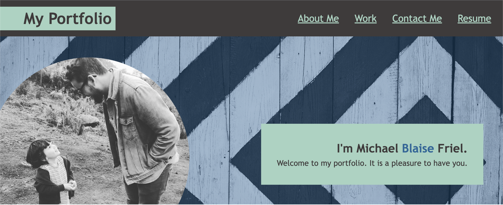
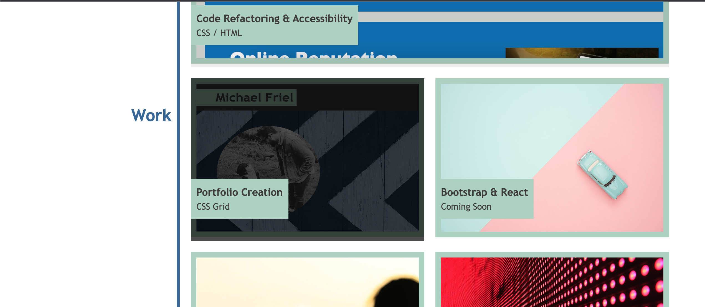
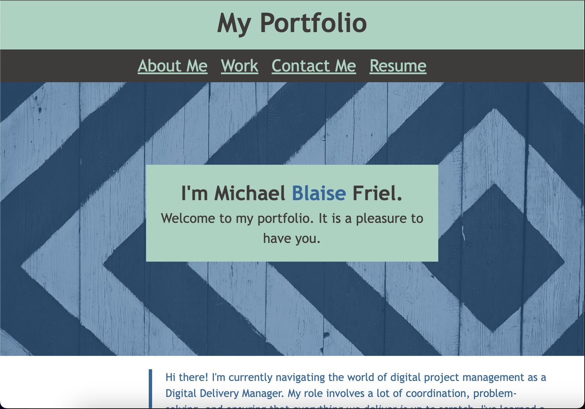

# My-portfolio

## Description

This webpage is intended for use as a portfolio for my previous and upcoming work. There are some key features which would benefit from clarification:
* Hero Section contains text, image, overlay for opacity and a profile image. The profile image is purposefully offset for aesthetic purposes.
* The webpage is responsive, with breakpoints at 960px and 748px. 
  * The content was not overly complicated, so only two needed. 
  * The first breakpoint causes the header areas to stack on top of one another ad removes the profile image.
  * The second breakpoint stacks the main page section into a single column.
* The work section contains 2 completed projects and 3 pending projects. 
  * The 2 projects link to appropriate destinations, but the 3 pending projects have had their links disabled and are listed as 'Coming Soon'.
  * There is an image overlay displayed on hover for the two completed projects, in order to indicate that they have a suitable link.

This screenshot shows the main hero section of the portfolio.

This screenshot shows the hover state for completed projects.

This screenshot shows the header area displayed as a column when in tablet view.